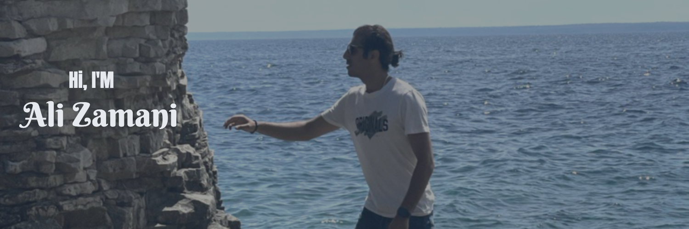

Hey there 👋

I’m Ali, a data scientist, machine learning developer, and chatbot developer. I am actively looking for data science, machine learning developer, or chatbot developer roles. Feel free to reach out to me if you have any openings.

Want to know more about me? [Check out my portfolio.](https://zamaniali1995.github.io/)

## 📌 Pinned Repositories

## &#x1f4c8; GitHub Stats

## 💼 Skills

More Skills

 

 

 

 
 

 

 

 

