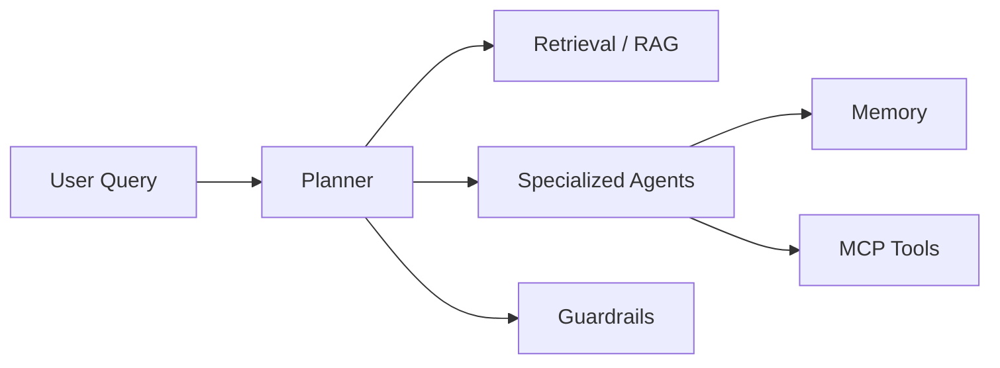

 

*Building production AI at scale — agentic systems, RAG, and ML pipelines*

 

---

## About Me

**Machine Learning Engineer** & **Agentic AI Engineer** at [Loblaw Digital](https://www.loblaw.ca/) · Toronto, ON

I architect enterprise agentic AI, production RAG, and shared platform infrastructure — shipping intelligent systems from design to deployment at retail scale.

Previously at **Priceline (Booking Holdings)**, I built Vertex AI ML pipelines, a scalable GenAI framework with LLM-as-a-Judge validation, and NLP features including hotel review summarization that drove a **30% conversion uplift** in A/B testing.

**M.Sc. Computer Science** — University of Alberta · [6 peer-reviewed publications](https://scholar.google.com/citations?user=cFk5cpEAAAAJ)

| **5+** Years | **97%** RAG Hit Rate | **$75K+** Cost Savings | **30%** Conversion Uplift |
|:---:|:---:|:---:|:---:|
| **6** Publications | **MCP** Agent Platform | **Vertex AI** Pipelines | **$10M+** Client Impact |

*97% retrieval hit rate — I still know where the other 3% live.*

---

## Currently Building

- **Agentic platform architecture** — planner-based agents, guardrails, and multi-tier memory
- **Agent Tools Package** — centralized MCP tooling adopted across AI product teams
- **Multi-agent orchestration** — evaluation frameworks and production deployment patterns

*Most of my week is evals, logs, and the occasional "why did it do that?"*

---

## Highlights

| Area | Impact |
|------|--------|
| **Agentic AI** | Led planner-based platform architecture with guardrails and long/short/episodic memory |
| **Production RAG** | Hybrid-search system — 97% hit rate, 78% precision, 97% recall, **$75K–$85K** projected savings |
| **GenAI Framework** | Scalable GCP framework with LLM-as-a-Judge validation, rate limiting, and CI/CD |
| **ML Pipelines** | Standardized Vertex AI pipelines with feature stores, versioning, and Airflow orchestration |
| **NLP at Scale** | Hotel review summarization with **30% conversion uplift**; MIRA chatbot with **97% intent F1** |

<b>Agentic architecture at a glance</b>

 

```mermaid
graph LR
    Q[User Query] --> P[Planner]
    P --> R[Retrieval / RAG]
    P --> A[Specialized Agents]
    A --> M[Memory]
    A --> T[MCP Tools]
    P --> G[Guardrails]
```

---

## Tech Stack

 

**AI / Agents**

**Cloud / MLOps**

---

## Featured Projects

 

---

## Publications

| Year | Title | Venue |
|------|-------|-------|
| 2023 | [Intent and Entity Detection with Data Augmentation for a Mental Health Chatbot](https://dl.acm.org/doi/10.1145/3570945.3607340) | ACM IVA |
| 2022 | [AI-Guided Mental Health Chatbot for Health Care Workers](https://www.researchprotocols.org/2022/7/e33717) | JMIR Research Protocols |
| 2022 | [Developing a Mental Health Virtual Assistant for Healthcare Workers](https://era.library.ualberta.ca/) | M.Sc. Thesis, UAlberta |
| 2021 | [Efficient Load Balancing for Service Function Chain Mapping](https://doi.org/10.1016/j.compeleceng.2020.106890) | Computers & Electrical Engineering |

[View all publications on Google Scholar →](https://scholar.google.com/citations?user=cFk5cpEAAAAJ)

---

## GitHub Analytics

 

 

 

 

---

**Open to collaborations on agentic AI, RAG, and production ML systems**

